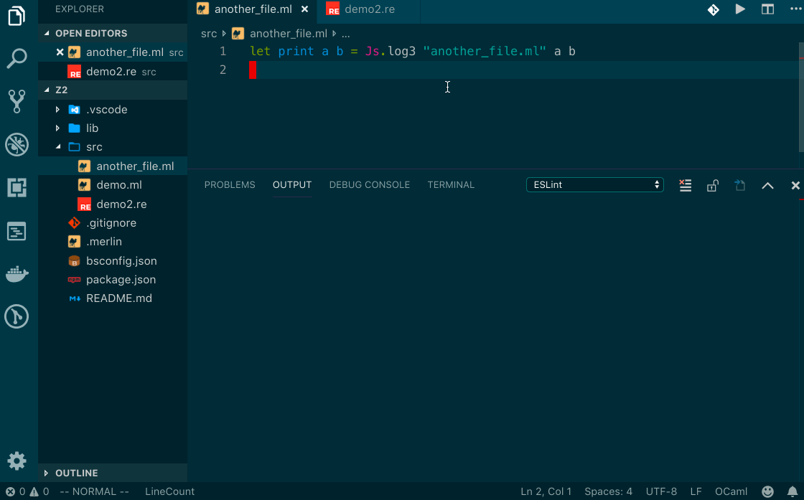

Easily run `.re` and `.ml` files directly in your BuckleScript project.



Note that `bs-run` does not compile `.re` and `.ml` files, it will execute `yarn build` and will use the BuckleScript compiled files.

Suggested flow to use in conjuction with VSCode [`formulahendry.code-runner`](https://marketplace.visualstudio.com/items?itemName=formulahendry.code-runner):

1. Edit your vscode user/workspace settings:

```json
  "code-runner.executorMapByFileExtension": {
    ".re": "bs-run",
    ".ml": "bs-run"
  },
```

```json
for OCaml you might also have to change:
  "code-runner.executorMap": {
    "ocaml": "bs-run",
  },
```

2. Add in `cmd+shift+p` -> `Preferences: Open Keyboard Shortcuts (JSON)`:

```json
{
  "key": "shift+enter",
  "command": "code-runner.run",
  "when": "editorTextFocus"
}
```

3. While in a `.re` or `.ml` file use `shift+enter` to run it

Now you can log and test short snippets of your code.
